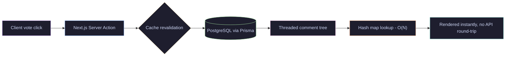

  

 

<a href="#-about">About</a> &nbsp;·&nbsp;
<a href="#-proof-of-work">Proof of Work</a> &nbsp;·&nbsp;
<a href="#-stack">Stack</a> &nbsp;·&nbsp;
<a href="#-currently-exploring">Currently Exploring</a> &nbsp;·&nbsp;
<a href="#-activity">Activity</a> &nbsp;·&nbsp;
<a href="#lets-build-something-worth-shipping">Connect</a>

 

### 👤 About

Full-stack developer based in Kolkata, four years deep into shipping things that go live, not just demos that run locally.

I started as the sole developer on 150+ client websites — every requirement, deadline, and design call was mine to own. That solo-ownership habit carried forward: today I architect full products end-to-end, from database schema to deployment pipeline, while managing client relationships across three countries without a project manager in between.

Currently building a SaaS platform from scratch and an AI-driven automation layer that's already cutting manual work down. Alongside that, I mentor a junior developer through the exact debugging sessions I used to have to figure out alone.

 

    

 

### 🧩 Proof of work

#### Reddit Clone — full-stack forum app

Not a tutorial clone. I built a **linear-to-tree algorithm in TypeScript** that resolves infinite-depth threaded comments in O(N) time via hash map lookup — eliminating the N+1 query problem most clone projects ignore. Real-time voting runs on Next.js Server Actions, so there's no extra API layer and cache revalidation is instant.

**Live:** [reddit-clone-fivechi.vercel.app](https://reddit-clone-fivechi.vercel.app) &nbsp;·&nbsp; **Code:** [github.com/therafiniac/reddit-clone](https://github.com/therafiniac/reddit-clone)

`Next.js` `TypeScript` `Prisma` `PostgreSQL` `Neon Auth` `Tailwind` `Shadcn UI`

 

### 🛠️ Stack

#### Frontend
 &nbsp;  &nbsp;  &nbsp;  &nbsp;  &nbsp;  &nbsp; 

#### Backend
 &nbsp; 

#### Data
 &nbsp;  &nbsp; 

#### Auth
 &nbsp;  &nbsp; 

#### Cloud
 &nbsp;  &nbsp;  &nbsp;  &nbsp; 

#### Workflow
 &nbsp;  &nbsp;  &nbsp;  &nbsp; 

 

### 🔭 Currently exploring

Working toward the **AZ-204 Azure Developer Associate** certification, building on the AZ-900 foundation.
Alongside that, researching architecture for a regional OTT platform — React Native on the client, PostgreSQL + Prisma + Redis on the backend.

 

 

### 📊 Activity

 

 

### 🐍 Snake

 

**Let's build something worth shipping.** &nbsp;·&nbsp; [rafiera.com](https://rafiera.com)

Bengali · English · Hindi

